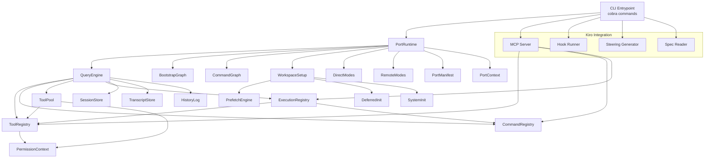
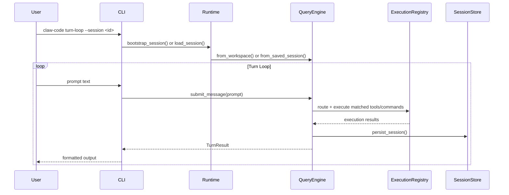

# Design Document: claw-code Go Port

## Overview

This design describes the complete port of the Python "claw-code" agent harness runtime to idiomatic Go, plus Kiro CLI integration. The Go port replicates all functionality from the original Python codebase (~20 modules, ~20 CLI subcommands) while following Go conventions: explicit error handling, interfaces for contracts, goroutines for concurrency, `encoding/json` with struct tags for serialization, and `embed` for reference data.

The resulting artifact is a single Go binary (`claw-code`) that:
1. Provides the same CLI subcommands as the Python `main.py`
2. Exposes an MCP server for Kiro tool/command access
3. Integrates with Kiro hooks, steering files, and spec workflows

### Key Design Decisions

- **Cobra for CLI**: Provides subcommand routing, help generation, and flag parsing — the Go standard for CLI tools.
- **Interfaces over inheritance**: Go has no class hierarchy. Each subsystem exposes an interface; concrete structs implement it.
- **`encoding/json` everywhere**: No third-party serialization. Struct tags handle all JSON mapping.
- **`go:embed` for snapshots**: Command and tool JSON snapshots are compiled into the binary.
- **Goroutines + channels for streaming**: The query engine's streaming mode uses a channel of events, matching Go idioms.
- **Functional options or config structs**: Subsystem constructors take config structs rather than long parameter lists.
- **Error values, not panics**: All fallible operations return `(T, error)`.

## Architecture

### High-Level Architecture



### Data Flow



### Package Structure

```
claw-code/
├── go.mod
├── go.sum
├── Makefile
├── cmd/
│   └── claw-code/
│       └── main.go              # CLI entrypoint, cobra root command
├── internal/
│   ├── models/
│   │   └── models.go            # Subsystem, PortingModule, PermissionDenial, UsageSummary, PortingBacklog
│   ├── permissions/
│   │   └── permissions.go       # ToolPermissionContext
│   ├── context/
│   │   └── context.go           # PortContext, workspace scanning
│   ├── commands/
│   │   └── commands.go          # CommandRegistry, CommandExecution
│   ├── tools/
│   │   └── tools.go             # ToolRegistry, ToolExecution
│   ├── toolpool/
│   │   └── toolpool.go          # ToolPool assembly
│   ├── execution/
│   │   └── execution.go         # MirroredCommand, MirroredTool, ExecutionRegistry
│   ├── queryengine/
│   │   └── queryengine.go       # QueryEngineConfig, TurnResult, QueryEnginePort
│   ├── session/
│   │   └── session.go           # StoredSession, SessionStore
│   ├── history/
│   │   └── history.go           # HistoryEvent, HistoryLog
│   ├── transcript/
│   │   └── transcript.go        # TranscriptStore
│   ├── runtime/
│   │   └── runtime.go           # RoutedMatch, RuntimeSession, PortRuntime
│   ├── setup/
│   │   └── setup.go             # WorkspaceSetup, SetupReport, PrefetchEngine
│   ├── deferred/
│   │   └── deferred.go          # DeferredInitResult
│   ├── systeminit/
│   │   └── systeminit.go        # build_system_init_message
│   ├── bootstrap/
│   │   └── bootstrap.go         # BootstrapGraph
│   ├── commandgraph/
│   │   └── commandgraph.go      # CommandGraph segmentation
│   ├── manifest/
│   │   └── manifest.go          # PortManifest
│   ├── modes/
│   │   ├── direct.go            # DirectModeReport, direct-connect, deep-link
│   │   └── remote.go            # RuntimeModeReport, remote, ssh, teleport
│   ├── mcp/
│   │   └── server.go            # MCP server (stdio + HTTP)
│   └── kiro/
│       ├── hooks.go             # Hook runner
│       ├── steering.go          # Steering file generator
│       └── specs.go             # Spec reader
├── data/
│   ├── commands.json            # Embedded command snapshot
│   └── tools.json               # Embedded tool snapshot
└── data.go                      # go:embed directives
```


## Components and Interfaces

### Core Interfaces

Each subsystem exposes an interface so that components depend on abstractions, not concrete types. This enables testing with mocks and future extensibility.

```go
// permissions package
type PermissionChecker interface {
    IsBlocked(toolName string) bool
}

// commands package
type CommandLookup interface {
    GetCommand(name string) (Command, error)
    FindCommands(query string) []Command
    FilterPlugins() []Command
    FilterSkills() []Command
    RenderIndex() string
}

// tools package
type ToolLookup interface {
    GetTool(name string) (Tool, error)
    FindTools(query string) []Tool
    FilterByPermissions(pc PermissionChecker) []Tool
    FilterByMode(simpleMode, includeMCP bool) []Tool
    RenderIndex() string
}

// execution package
type Executable interface {
    Name() string
    Kind() string // "command" or "tool"
    Execute(args map[string]interface{}) (interface{}, error)
}

type ExecutionLookup interface {
    Lookup(name string) (Executable, error)
    Build(commands CommandLookup, tools ToolLookup) error
}

// session package
type SessionPersistence interface {
    Save(session StoredSession) error
    Load(sessionID string) (StoredSession, error)
}

// transcript package
type TranscriptManager interface {
    Append(entry TranscriptEntry) error
    Compact() error
    Replay() ([]TranscriptEntry, error)
    Flush() error
}

// queryengine package
type QueryProcessor interface {
    SubmitMessage(prompt string) (TurnResult, error)
    StreamSubmitMessage(prompt string) (<-chan StreamEvent, error)
    PersistSession() error
    FlushTranscript() error
    RenderSummary() string
}

// runtime package
type RuntimeOrchestrator interface {
    RoutePrompt(prompt string) ([]RoutedMatch, error)
    BootstrapSession() (RuntimeSession, error)
}
```

### Component Descriptions

#### models (internal/models)
Pure data structs with JSON tags. No external dependencies. Methods: `UsageSummary.AddTurn()`, `PortingBacklog.SummaryLines()`.

#### permissions (internal/permissions)
`ToolPermissionContext` holds two sets: `denyNames map[string]struct{}` and `denyPrefixes []string`. The `IsBlocked` method checks exact match first, then prefix scan. Immutable after construction.

#### context (internal/context)
`PortContext` scans the workspace filesystem using `filepath.Walk`. Counts files by extension. Returns zero counts for missing directories (no error). `Render()` produces Markdown.

#### commands (internal/commands)
`CommandRegistry` loads from embedded JSON via `json.Unmarshal`. Stores commands in a `map[string]Command` for O(1) lookup. `FindCommands` does case-insensitive substring match via `strings.Contains(strings.ToLower(...))`. Filtering methods return slices based on command category field.

#### tools (internal/tools)
`ToolRegistry` mirrors `CommandRegistry` structure. Additional filtering: `FilterByPermissions` calls `PermissionChecker.IsBlocked` on each tool. `FilterByMode` checks `simpleMode` and `includeMCP` flags on tool metadata.

#### toolpool (internal/toolpool)
`ToolPool` is the assembled result of applying all filters. `AssembleToolPool` takes a `ToolLookup`, mode flags, and a `PermissionChecker`, chains the filters, and returns the pool. Idempotent: same inputs always produce same output.

#### execution (internal/execution)
`MirroredCommand` and `MirroredTool` both implement `Executable`. `ExecutionRegistry` holds a `map[string]Executable` built from both registries. Single `Lookup` method for unified dispatch.

#### queryengine (internal/queryengine)
Central processing component. `QueryEngineConfig` holds turn limits, budget, compaction threshold. Two constructors: `FromWorkspace` (new session) and `FromSavedSession` (restore). `SubmitMessage` processes a prompt through routing, execution, and result assembly. `StreamSubmitMessage` returns a `<-chan StreamEvent` for incremental output. Tracks cumulative token usage via `UsageSummary`. Triggers compaction when turn count exceeds threshold. Stops on budget exceeded.

#### session (internal/session)
`SessionStore` manages `.port_sessions/` directory. `Save` marshals to JSON with `json.MarshalIndent`, creates directory with `os.MkdirAll`, writes atomically (write to temp, rename). `Load` reads and unmarshals.

#### history (internal/history)
`HistoryLog` is an append-only slice of `HistoryEvent`. Each event has a timestamp, kind, and payload. `Render()` produces Markdown timeline.

#### transcript (internal/transcript)
`TranscriptStore` holds entries in memory with disk backing. `Append` adds to slice. `Compact` summarizes older entries (keeps last N, summarizes rest). `Replay` returns full ordered slice. `Flush` writes to disk file and clears memory buffer.

#### runtime (internal/runtime)
`PortRuntime` orchestrates everything. `RoutePrompt` scores prompt against all registered commands/tools using substring matching and returns sorted `RoutedMatch` list. `BootstrapSession` initializes all subsystems, runs setup, deferred init, builds system init message, and returns a ready `RuntimeSession`.

#### setup (internal/setup)
`WorkspaceSetup` detects Go version (`exec.Command("go", "version")`), platform (`runtime.GOOS`), test command. `PrefetchEngine` runs prefetches concurrently via `sync.WaitGroup` + goroutines. Each prefetch returns `PrefetchResult` with optional error. `RunSetup` combines both.

#### deferred (internal/deferred)
`DeferredInitResult` captures plugin init, skill init, MCP prefetch, session hooks results. Each step runs independently; errors are captured per-step, not propagated.

#### systeminit (internal/systeminit)
`BuildSystemInitMessage` assembles a string from workspace context, manifest, tool pool, and bootstrap graph renders.

#### bootstrap (internal/bootstrap)
`BootstrapGraph` defines stages as a DAG. Each stage has a name, dependencies, and status. `Render()` outputs Markdown representation.

#### commandgraph (internal/commandgraph)
`CommandGraph` takes the command list and segments into builtin, plugin-like, and skill-like categories based on command metadata.

#### manifest (internal/manifest)
`PortManifest` scans `src/` directory, discovers Go files, and builds a manifest struct. Returns error if directory doesn't exist. `Render()` outputs Markdown.

#### modes (internal/modes)
`direct.go`: `DirectModeReport` for direct-connect and deep-link modes. `remote.go`: `RuntimeModeReport` for remote, SSH, and teleport modes. Each mode function returns a report struct or error.

#### mcp (internal/mcp)
MCP server supporting stdio and HTTP transports. Wraps `ExecutionRegistry` to expose tools and commands via MCP protocol. Handles request validation, execution dispatch, and MCP-compliant error responses.

#### kiro (internal/kiro)
`hooks.go`: Reads and executes hook definitions from `.kiro/hooks/`. `steering.go`: Generates steering files from runtime config. `specs.go`: Reads spec files from `.kiro/specs/` for workflow integration.


## Data Models

### Core Data Structs

```go
package models

// Subsystem represents a logical subsystem in the porting project.
type Subsystem struct {
    Name        string   `json:"name"`
    Description string   `json:"description"`
    Modules     []string `json:"modules"`
}

// PortingModule represents a single module to be ported.
type PortingModule struct {
    Name         string `json:"name"`
    Subsystem    string `json:"subsystem"`
    SourceFile   string `json:"source_file"`
    Status       string `json:"status"`
    Dependencies []string `json:"dependencies"`
}

// PermissionDenial records a tool access denial.
type PermissionDenial struct {
    ToolName string `json:"tool_name"`
    Reason   string `json:"reason"`
}

// UsageSummary tracks cumulative token usage across turns.
type UsageSummary struct {
    TotalInputTokens  int `json:"total_input_tokens"`
    TotalOutputTokens int `json:"total_output_tokens"`
    TurnCount         int `json:"turn_count"`
}

// AddTurn adds token counts from a single turn.
func (u *UsageSummary) AddTurn(inputTokens, outputTokens int) {
    u.TotalInputTokens += inputTokens
    u.TotalOutputTokens += outputTokens
    u.TurnCount++
}

// PortingBacklog represents the backlog of modules to port.
type PortingBacklog struct {
    Modules []PortingModule `json:"modules"`
}

// SummaryLines returns a string slice summarizing each module's status.
func (b *PortingBacklog) SummaryLines() []string {
    lines := make([]string, 0, len(b.Modules))
    for _, m := range b.Modules {
        lines = append(lines, fmt.Sprintf("%s (%s): %s", m.Name, m.Subsystem, m.Status))
    }
    return lines
}
```

### Registry Data Structs

```go
package commands

// Command represents a loaded command definition.
type Command struct {
    Name        string                 `json:"name"`
    Description string                 `json:"description"`
    Category    string                 `json:"category"`
    Args        map[string]ArgDef      `json:"args"`
    Metadata    map[string]interface{} `json:"metadata"`
}

// ArgDef defines a command argument.
type ArgDef struct {
    Type        string `json:"type"`
    Required    bool   `json:"required"`
    Description string `json:"description"`
    Default     interface{} `json:"default,omitempty"`
}

// CommandExecution holds the result of executing a command.
type CommandExecution struct {
    CommandName string      `json:"command_name"`
    Output      interface{} `json:"output"`
    Error       string      `json:"error,omitempty"`
    DurationMs  int64       `json:"duration_ms"`
}
```

```go
package tools

// Tool represents a loaded tool definition.
type Tool struct {
    Name        string                 `json:"name"`
    Description string                 `json:"description"`
    SimpleMode  bool                   `json:"simple_mode"`
    MCPEnabled  bool                   `json:"mcp_enabled"`
    Args        map[string]ArgDef      `json:"args"`
    Metadata    map[string]interface{} `json:"metadata"`
}

// ArgDef defines a tool argument.
type ArgDef struct {
    Type        string      `json:"type"`
    Required    bool        `json:"required"`
    Description string      `json:"description"`
    Default     interface{} `json:"default,omitempty"`
}

// ToolExecution holds the result of executing a tool.
type ToolExecution struct {
    ToolName   string      `json:"tool_name"`
    Output     interface{} `json:"output"`
    Error      string      `json:"error,omitempty"`
    DurationMs int64       `json:"duration_ms"`
}
```

### Query Engine Data Structs

```go
package queryengine

// QueryEngineConfig holds engine configuration.
type QueryEngineConfig struct {
    MaxTurns         int  `json:"max_turns"`
    MaxBudgetTokens  int  `json:"max_budget_tokens"`
    CompactAfterTurns int `json:"compact_after_turns"`
    StructuredOutput bool `json:"structured_output"`
}

// TurnResult holds the output of a single turn.
type TurnResult struct {
    Output            string              `json:"output"`
    MatchedCommands   []string            `json:"matched_commands"`
    MatchedTools      []string            `json:"matched_tools"`
    PermissionDenials []PermissionDenial  `json:"permission_denials"`
    Usage             UsageSummary        `json:"usage"`
    StopReason        string              `json:"stop_reason"`
}

// StreamEvent represents a single streaming event.
type StreamEvent struct {
    Kind    string `json:"kind"`    // "text", "tool_call", "done", "error"
    Payload string `json:"payload"`
}
```

### Session Data Structs

```go
package session

// StoredSession represents a persisted session.
type StoredSession struct {
    SessionID    string          `json:"session_id"`
    CreatedAt    time.Time       `json:"created_at"`
    UpdatedAt    time.Time       `json:"updated_at"`
    Config       QueryEngineConfig `json:"config"`
    Usage        UsageSummary    `json:"usage"`
    Messages     []Message       `json:"messages"`
    Metadata     map[string]interface{} `json:"metadata,omitempty"`
}

// Message represents a conversation message.
type Message struct {
    Role    string `json:"role"`
    Content string `json:"content"`
}
```

### Runtime Data Structs

```go
package runtime

// RoutedMatch represents a prompt routing match.
type RoutedMatch struct {
    Kind       string  `json:"kind"`        // "command" or "tool"
    Name       string  `json:"name"`
    SourceHint string  `json:"source_hint"`
    Score      float64 `json:"score"`
}

// RuntimeSession holds full session state.
type RuntimeSession struct {
    SessionID   string
    Engine      QueryProcessor
    History     *HistoryLog
    Transcript  TranscriptManager
    ToolPool    *ToolPool
    BootstrapOK bool
}
```

### Setup and Prefetch Data Structs

```go
package setup

// SetupReport holds workspace environment info.
type SetupReport struct {
    GoVersion    string          `json:"go_version"`
    Platform     string          `json:"platform"`
    TestCommand  string          `json:"test_command"`
    Prefetches   []PrefetchResult `json:"prefetches"`
    DeferredInit DeferredInitResult `json:"deferred_init"`
}

// PrefetchResult holds the result of a single prefetch operation.
type PrefetchResult struct {
    Name    string `json:"name"`
    Success bool   `json:"success"`
    Data    string `json:"data,omitempty"`
    Error   string `json:"error,omitempty"`
}
```

### Transcript Data Structs

```go
package transcript

// TranscriptEntry represents a single transcript entry.
type TranscriptEntry struct {
    Timestamp time.Time `json:"timestamp"`
    Role      string    `json:"role"`
    Content   string    `json:"content"`
    Metadata  map[string]interface{} `json:"metadata,omitempty"`
}
```

### History Data Structs

```go
package history

// HistoryEvent represents a single session event.
type HistoryEvent struct {
    Timestamp time.Time `json:"timestamp"`
    Kind      string    `json:"kind"`
    Payload   string    `json:"payload"`
}

// HistoryLog is an ordered collection of events.
type HistoryLog struct {
    Events []HistoryEvent `json:"events"`
}
```

### Embedded Data

```go
package data

import "embed"

//go:embed data/commands.json
var CommandsJSON []byte

//go:embed data/tools.json
var ToolsJSON []byte
```


## Correctness Properties

*A property is a characteristic or behavior that should hold true across all valid executions of a system — essentially, a formal statement about what the system should do. Properties serve as the bridge between human-readable specifications and machine-verifiable correctness guarantees.*

### Property 1: JSON Serialization Round-Trip

*For any* valid instance of any serializable struct (Subsystem, PortingModule, PermissionDenial, UsageSummary, PortingBacklog, Command, Tool, StoredSession, HistoryEvent, TranscriptEntry, QueryEngineConfig, TurnResult, RoutedMatch, SetupReport, PrefetchResult), serializing to JSON via `json.Marshal` and deserializing back via `json.Unmarshal` should produce a struct equal to the original.

**Validates: Requirements 1.4, 22.1**

### Property 2: UsageSummary AddTurn Accumulation

*For any* UsageSummary and any sequence of non-negative (inputTokens, outputTokens) pairs, calling AddTurn for each pair should result in TotalInputTokens equal to the sum of all inputTokens, TotalOutputTokens equal to the sum of all outputTokens, and TurnCount equal to the number of AddTurn calls.

**Validates: Requirements 1.2**

### Property 3: PortingBacklog SummaryLines Length and Content

*For any* PortingBacklog with N modules, SummaryLines should return exactly N strings, and each string should contain the corresponding module's Name and Status.

**Validates: Requirements 1.3**

### Property 4: Permission Context Correctness

*For any* ToolPermissionContext built from deny-names and deny-prefixes, and *for any* tool name, IsBlocked should return true if and only if the tool name exactly matches an entry in deny-names OR the tool name starts with an entry in deny-prefixes.

**Validates: Requirements 2.3, 2.4, 2.5**

### Property 5: Registry Lookup Correctness

*For any* registry (CommandRegistry or ToolRegistry) populated with a set of entries, and *for any* name string: if the name exists in the registry, the lookup should return the matching entry; if the name does not exist, the lookup should return an error.

**Validates: Requirements 4.2, 5.2**

### Property 6: Registry Search Completeness

*For any* registry (CommandRegistry or ToolRegistry) and *for any* search query string, the search results should contain exactly those entries whose names contain the query as a case-insensitive substring — no false positives and no false negatives.

**Validates: Requirements 4.3, 5.3**

### Property 7: Command Category Partitioning

*For any* set of commands with category metadata, segmenting into builtin, plugin-like, and skill-like categories should produce a partition: every command appears in exactly one category, and the union of all categories equals the original set.

**Validates: Requirements 4.4, 15.4**

### Property 8: Tool Pool Filter Composition

*For any* set of tools, mode flags (simpleMode, includeMCP), and PermissionContext, the assembled ToolPool should contain exactly those tools that satisfy all three filters simultaneously: not blocked by permissions, matching simpleMode flag, and matching includeMCP flag.

**Validates: Requirements 5.4, 5.5, 6.2**

### Property 9: Tool Pool Assembly Idempotence

*For any* set of tools, mode flags, and PermissionContext, assembling the ToolPool twice with the same inputs should produce identical results.

**Validates: Requirements 6.3**

### Property 10: Execution Registry Completeness

*For any* CommandRegistry with C commands and ToolRegistry with T tools, building an ExecutionRegistry should produce a registry containing exactly C + T entries, and each entry should be retrievable by name via Lookup.

**Validates: Requirements 7.2, 7.3**

### Property 11: Render Completeness

*For any* component with a Render/RenderIndex method (CommandRegistry, ToolRegistry, PortContext, HistoryLog, BootstrapGraph), the rendered Markdown string should contain the name/identifier of every item in the component's collection.

**Validates: Requirements 3.3, 4.5, 5.6, 10.3, 15.3**

### Property 12: Transcript Append-Replay Round-Trip

*For any* sequence of TranscriptEntry values appended to a TranscriptStore, calling Replay should return the entries in the same order they were appended, with identical content.

**Validates: Requirements 11.2, 11.4**

### Property 13: Transcript Flush Clears Buffer

*For any* TranscriptStore with one or more entries, after calling Flush, the in-memory buffer should be empty (Replay returns an empty slice).

**Validates: Requirements 11.5**

### Property 14: Transcript Compaction Reduces Size

*For any* TranscriptStore with entries exceeding the compaction threshold, calling Compact should result in a transcript with fewer or equal entries compared to the original.

**Validates: Requirements 11.3**

### Property 15: History Log Ordering

*For any* sequence of HistoryEvents appended to a HistoryLog, the Events slice should contain them in the exact order of insertion.

**Validates: Requirements 10.2**

### Property 16: Route Prompt Score Ordering

*For any* prompt and set of registered commands/tools, the list of RoutedMatch results returned by RoutePrompt should be sorted by Score in descending order.

**Validates: Requirements 12.3**

### Property 17: Session Store File Round-Trip

*For any* valid StoredSession, saving it to disk via SessionStore.Save and loading it back via SessionStore.Load should produce an equivalent StoredSession.

**Validates: Requirements 9.4**

### Property 18: Query Engine Budget Enforcement

*For any* QueryEngineConfig with a max_budget_tokens value B, if the cumulative token usage across turns exceeds B, the engine should stop processing and set the stop reason to "budget_exceeded".

**Validates: Requirements 8.6**

### Property 19: Query Engine Compaction Trigger

*For any* QueryEngineConfig with compact_after_turns value N, after processing N+1 turns, the engine should have triggered at least one message compaction.

**Validates: Requirements 8.5**

### Property 20: Concurrent Error Isolation

*For any* set of concurrent operations (prefetches or deferred init steps) where one or more operations fail, all non-failing operations should still complete successfully and return their results.

**Validates: Requirements 13.4, 14.3**

### Property 21: Workspace File Count Accuracy

*For any* directory tree, the file count reported by PortContext.BuildPortContext should equal the actual number of files with matching extensions in that directory tree.

**Validates: Requirements 3.2**

### Property 22: CLI Invalid Argument Rejection

*For any* CLI subcommand and *for any* set of invalid arguments, the CLI should exit with a non-zero code and print a usage message to stderr.

**Validates: Requirements 18.3**

### Property 23: MCP Valid Request Execution

*For any* valid MCP tool invocation request (tool exists, args are valid), the MCP server should execute the tool and return a response containing the tool's result in MCP format.

**Validates: Requirements 19.5**

### Property 24: MCP Invalid Request Error Response

*For any* invalid MCP request (unknown tool, malformed args), the MCP server should return an MCP-compliant error response with an error code and message.

**Validates: Requirements 19.6**

### Property 25: Malformed JSON Parse Error

*For any* malformed JSON string provided as embedded data, the registry initialization should return a non-nil, descriptive error.

**Validates: Requirements 21.3**

### Property 26: Steering File Generation Completeness

*For any* runtime configuration and session state, the generated steering file should be a valid file containing configuration sections derived from the input state.

**Validates: Requirements 19.3**

### Property 27: Execution Result Name Consistency

*For any* command or tool execution, the returned result struct (CommandExecution or ToolExecution) should have its CommandName/ToolName field equal to the name of the command/tool that was executed.

**Validates: Requirements 4.6, 5.7**

### Property 28: System Init Message Non-Empty

*For any* valid set of inputs (workspace context, manifest, tool pool, bootstrap graph), BuildSystemInitMessage should return a non-empty string containing identifiable sections from each input.

**Validates: Requirements 15.1**


## Error Handling

### Strategy

All errors follow Go conventions: functions return `(T, error)` tuples. No panics except for truly unrecoverable programmer errors (e.g., embedded data corruption at init).

### Error Categories

| Category | Handling | Example |
|----------|----------|---------|
| **Registry lookup miss** | Return `fmt.Errorf("command not found: %s", name)` | `GetCommand("nonexistent")` |
| **JSON parse failure** | Return wrapped error: `fmt.Errorf("parsing commands.json: %w", err)` | Malformed embedded data |
| **Filesystem I/O** | Return wrapped error with path context | Session save/load, manifest scan |
| **Permission denial** | Return `PermissionDenial` struct (not an error) | Blocked tool access |
| **Budget exceeded** | Set `TurnResult.StopReason = "budget_exceeded"` | Token limit hit |
| **Prefetch failure** | Capture in `PrefetchResult.Error`, continue others | MDM read timeout |
| **Deferred init failure** | Capture in result field, continue others | Plugin init crash |
| **MCP protocol error** | Return MCP-compliant error response with code | Invalid request |
| **CLI argument error** | Print usage to stderr, `os.Exit(1)` | Missing required flag |
| **Missing directory** | Return zero counts or create directory | Workspace scan, session dir |

### Error Wrapping

Use `fmt.Errorf` with `%w` verb for error wrapping so callers can use `errors.Is` and `errors.As`:

```go
func (s *SessionStore) Load(id string) (StoredSession, error) {
    data, err := os.ReadFile(s.path(id))
    if err != nil {
        return StoredSession{}, fmt.Errorf("loading session %s: %w", id, err)
    }
    var session StoredSession
    if err := json.Unmarshal(data, &session); err != nil {
        return StoredSession{}, fmt.Errorf("parsing session %s: %w", id, err)
    }
    return session, nil
}
```

### Sentinel Errors

Define package-level sentinel errors for common cases:

```go
var (
    ErrCommandNotFound = errors.New("command not found")
    ErrToolNotFound    = errors.New("tool not found")
    ErrSessionNotFound = errors.New("session not found")
    ErrBudgetExceeded  = errors.New("budget exceeded")
)
```

## Testing Strategy

### Dual Testing Approach

The project uses both unit tests and property-based tests for comprehensive coverage:

- **Unit tests**: Verify specific examples, edge cases, error conditions, and integration points
- **Property-based tests**: Verify universal properties across randomly generated inputs

### Property-Based Testing Library

Use **[`pgregory.net/rapid`](https://github.com/flyingmutant/rapid)** — a Go property-based testing library that integrates with `testing.T`, supports generators, and provides shrinking.

Each property test must:
- Run a minimum of **100 iterations**
- Reference its design document property via a comment tag
- Use the format: `// Feature: claw-code-go-port, Property {N}: {title}`

### Test Organization

```
internal/
├── models/
│   ├── models.go
│   └── models_test.go          # Unit + property tests for data models
├── permissions/
│   ├── permissions.go
│   └── permissions_test.go     # Unit + property tests for permission context
├── commands/
│   ├── commands.go
│   └── commands_test.go        # Unit + property tests for command registry
├── tools/
│   ├── tools.go
│   └── tools_test.go           # Unit + property tests for tool registry
├── toolpool/
│   ├── toolpool.go
│   └── toolpool_test.go        # Unit + property tests for tool pool
├── execution/
│   ├── execution.go
│   └── execution_test.go       # Unit + property tests for execution registry
├── queryengine/
│   ├── queryengine.go
│   └── queryengine_test.go     # Unit + property tests for query engine
├── session/
│   ├── session.go
│   └── session_test.go         # Unit + property tests for session store
├── history/
│   ├── history.go
│   └── history_test.go         # Unit + property tests for history log
├── transcript/
│   ├── transcript.go
│   └── transcript_test.go      # Unit + property tests for transcript store
├── runtime/
│   ├── runtime.go
│   └── runtime_test.go         # Unit + property tests for runtime
├── setup/
│   ├── setup.go
│   └── setup_test.go           # Unit + property tests for setup/prefetch
├── mcp/
│   ├── server.go
│   └── server_test.go          # Unit + property tests for MCP server
└── kiro/
    ├── steering.go
    └── steering_test.go        # Unit + property tests for steering generation
```

### Property Test Mapping

Each correctness property maps to exactly one property-based test:

| Property | Test File | Tag |
|----------|-----------|-----|
| 1: JSON Serialization Round-Trip | `models_test.go`, `session_test.go`, etc. | `Feature: claw-code-go-port, Property 1: JSON Serialization Round-Trip` |
| 2: UsageSummary AddTurn Accumulation | `models_test.go` | `Feature: claw-code-go-port, Property 2: UsageSummary AddTurn Accumulation` |
| 3: PortingBacklog SummaryLines | `models_test.go` | `Feature: claw-code-go-port, Property 3: PortingBacklog SummaryLines Length and Content` |
| 4: Permission Context Correctness | `permissions_test.go` | `Feature: claw-code-go-port, Property 4: Permission Context Correctness` |
| 5: Registry Lookup Correctness | `commands_test.go`, `tools_test.go` | `Feature: claw-code-go-port, Property 5: Registry Lookup Correctness` |
| 6: Registry Search Completeness | `commands_test.go`, `tools_test.go` | `Feature: claw-code-go-port, Property 6: Registry Search Completeness` |
| 7: Command Category Partitioning | `commands_test.go`, `commandgraph_test.go` | `Feature: claw-code-go-port, Property 7: Command Category Partitioning` |
| 8: Tool Pool Filter Composition | `toolpool_test.go` | `Feature: claw-code-go-port, Property 8: Tool Pool Filter Composition` |
| 9: Tool Pool Assembly Idempotence | `toolpool_test.go` | `Feature: claw-code-go-port, Property 9: Tool Pool Assembly Idempotence` |
| 10: Execution Registry Completeness | `execution_test.go` | `Feature: claw-code-go-port, Property 10: Execution Registry Completeness` |
| 11: Render Completeness | Various `_test.go` files | `Feature: claw-code-go-port, Property 11: Render Completeness` |
| 12: Transcript Append-Replay Round-Trip | `transcript_test.go` | `Feature: claw-code-go-port, Property 12: Transcript Append-Replay Round-Trip` |
| 13: Transcript Flush Clears Buffer | `transcript_test.go` | `Feature: claw-code-go-port, Property 13: Transcript Flush Clears Buffer` |
| 14: Transcript Compaction Reduces Size | `transcript_test.go` | `Feature: claw-code-go-port, Property 14: Transcript Compaction Reduces Size` |
| 15: History Log Ordering | `history_test.go` | `Feature: claw-code-go-port, Property 15: History Log Ordering` |
| 16: Route Prompt Score Ordering | `runtime_test.go` | `Feature: claw-code-go-port, Property 16: Route Prompt Score Ordering` |
| 17: Session Store File Round-Trip | `session_test.go` | `Feature: claw-code-go-port, Property 17: Session Store File Round-Trip` |
| 18: Query Engine Budget Enforcement | `queryengine_test.go` | `Feature: claw-code-go-port, Property 18: Query Engine Budget Enforcement` |
| 19: Query Engine Compaction Trigger | `queryengine_test.go` | `Feature: claw-code-go-port, Property 19: Query Engine Compaction Trigger` |
| 20: Concurrent Error Isolation | `setup_test.go` | `Feature: claw-code-go-port, Property 20: Concurrent Error Isolation` |
| 21: Workspace File Count Accuracy | `context_test.go` | `Feature: claw-code-go-port, Property 21: Workspace File Count Accuracy` |
| 22: CLI Invalid Argument Rejection | `main_test.go` | `Feature: claw-code-go-port, Property 22: CLI Invalid Argument Rejection` |
| 23: MCP Valid Request Execution | `server_test.go` | `Feature: claw-code-go-port, Property 23: MCP Valid Request Execution` |
| 24: MCP Invalid Request Error Response | `server_test.go` | `Feature: claw-code-go-port, Property 24: MCP Invalid Request Error Response` |
| 25: Malformed JSON Parse Error | `commands_test.go`, `tools_test.go` | `Feature: claw-code-go-port, Property 25: Malformed JSON Parse Error` |
| 26: Steering File Generation Completeness | `steering_test.go` | `Feature: claw-code-go-port, Property 26: Steering File Generation Completeness` |
| 27: Execution Result Name Consistency | `commands_test.go`, `tools_test.go` | `Feature: claw-code-go-port, Property 27: Execution Result Name Consistency` |
| 28: System Init Message Non-Empty | `systeminit_test.go` | `Feature: claw-code-go-port, Property 28: System Init Message Non-Empty` |

### Unit Test Focus Areas

Unit tests should cover:
- **Specific examples**: Known command/tool lookups, specific permission denials
- **Edge cases**: Empty registries, zero-value structs, missing directories, empty transcripts, zero-budget configs
- **Error conditions**: Malformed JSON, missing files, invalid session IDs, unknown subcommands
- **Integration points**: CLI → Runtime → QueryEngine flow, MCP request → ExecutionRegistry → Tool flow

### Running Tests

```bash
# All tests
go test ./...

# With verbose output
go test -v ./...

# Specific package
go test -v ./internal/models/...

# With race detector
go test -race ./...
```

### Generator Strategy (for rapid)

Key generators needed for property tests:

- **Struct generators**: Random valid instances of each data model struct
- **String generators**: Tool/command names (alphanumeric + hyphens), search queries, prompts
- **Collection generators**: Slices of commands/tools with unique names
- **Config generators**: QueryEngineConfig with valid ranges (positive ints)
- **Permission generators**: Random deny-name sets and deny-prefix lists
- **JSON generators**: Valid and malformed JSON strings

Example generator pattern with `rapid`:

```go
func genUsageSummary(t *rapid.T) UsageSummary {
    return UsageSummary{
        TotalInputTokens:  rapid.IntRange(0, 1000000).Draw(t, "input_tokens"),
        TotalOutputTokens: rapid.IntRange(0, 1000000).Draw(t, "output_tokens"),
        TurnCount:         rapid.IntRange(0, 10000).Draw(t, "turn_count"),
    }
}
```

